# NexMeet - Event Ticket Booking Syste

NexMeet is a full-stack event ticket booking web application built with **Java Spring Boot**, **MySQL**, **Spring Data JPA**, **Thymeleaf**, **HTML**, and **CSS**.

The system allows customers to browse events, book tickets, view their tickets, review events, and use QR-based tickets. It also includes an admin dashboard where admins can manage events, view bookings, verify tickets, and control event availability.

## Project Overview

NexMeet was developed as a portfolio project to demonstrate full-stack web development, backend logic, database relationships, validation, role-based access control, and a clean user interface.

The application has two main user roles:

* **Customer** - Can register, log in, browse events, book tickets, view tickets, and submit reviews.
* **Admin** - Can manage events, view bookings, verify tickets, and access the admin dashboard.

## Features

### Customer Features

* Customer registration and login
* Secure password hashing using BCrypt
* Browse available events
* Search events by name or location
* View event details
* Book tickets
* View personal ticket history
* Cancel tickets
* View printable ticket with QR code
* Submit event reviews after booking
* Friendly validation and error messages

### Admin Features

* Admin dashboard with system statistics
* Add new events
* Edit event details
* Delete events
* Manage event images, descriptions, prices, dates, and ticket availability
* View all customer bookings
* Verify tickets using ticket number
* Check in tickets
* Prevent duplicate ticket usage
* Access control for admin-only pages

### Validation and Error Handling

* Event name, location, price, date, and ticket quantity validation
* User registration validation
* Duplicate email prevention
* Booking quantity validation
* Ticket availability validation
* Event-ended booking prevention
* Review validation
* Duplicate review prevention
* Custom error page for invalid records and wrong URLs
* Access denied page for unauthorized users

## Tech Stack

| Layer         | Technology                                         |
| ------------- | -------------------------------------------------- |
| Backend       | Java, Spring Boot                                  |
| Web Framework | Spring MVC                                         |
| Database      | MySQL                                              |
| ORM           | Spring Data JPA, Hibernate                         |
| Frontend      | Thymeleaf, HTML, CSS                               |
| Security      | BCrypt password hashing, session-based role checks |
| QR Code       | ZXing                                              |
| Build Tool    | Maven                                              |

## Screenshots

### Home Page

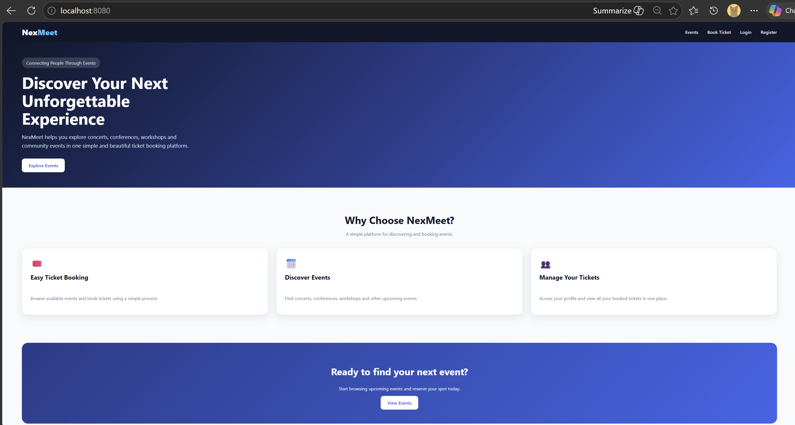

### Events Page

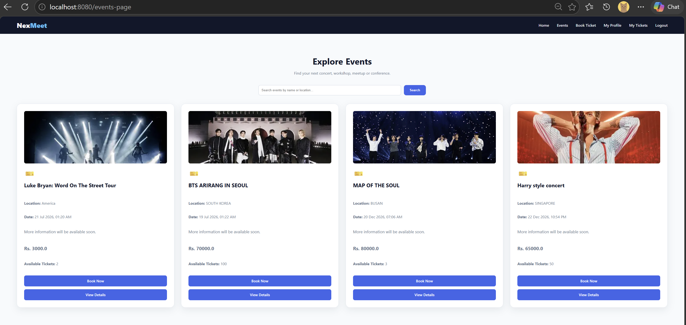

### Event Details Page

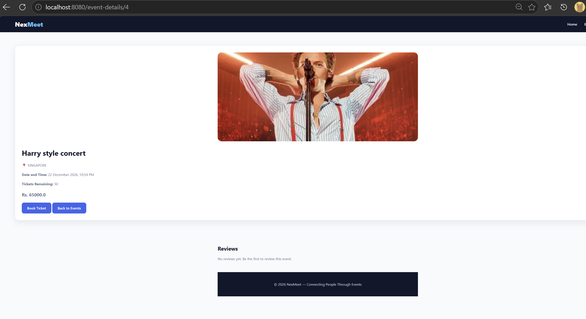

### Book Ticket Page

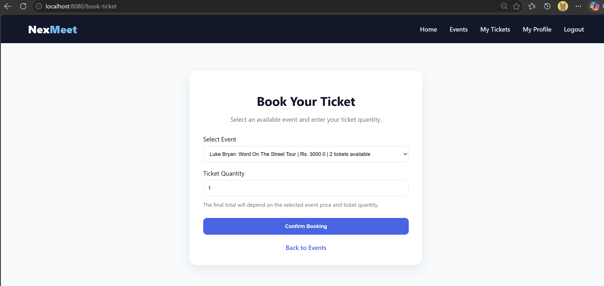

### My Tickets Page

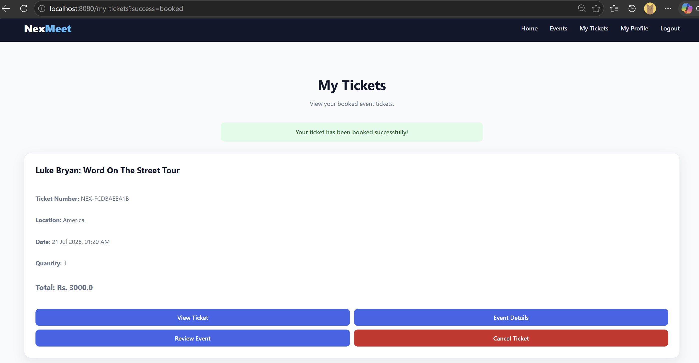

### Ticket with QR Code

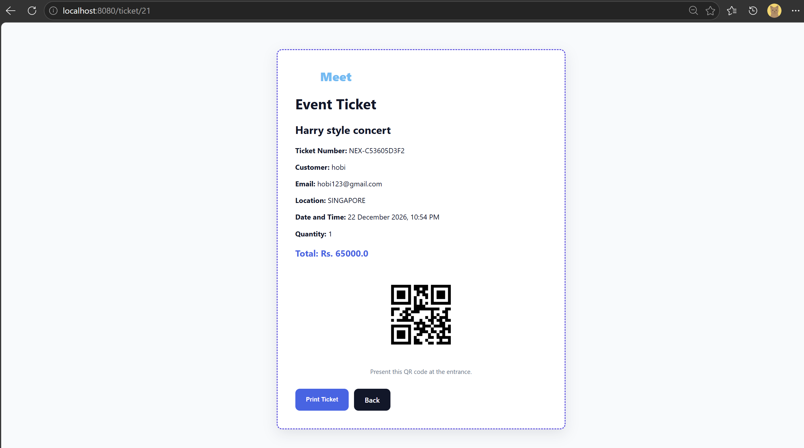

### Admin Dashboard

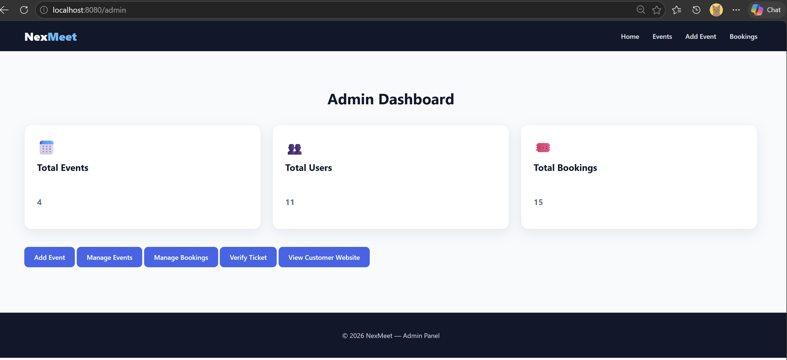

### Manage Events

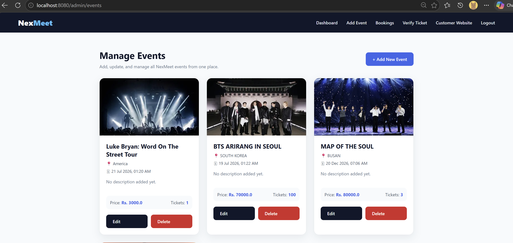

### Validation Example

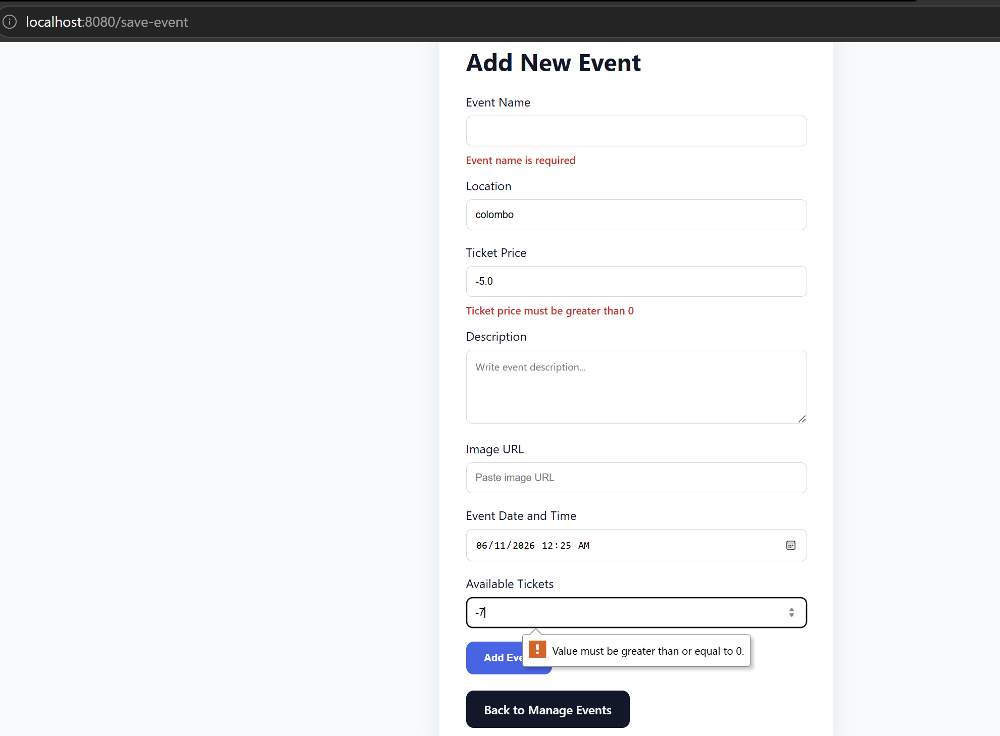

### Ticket Verification

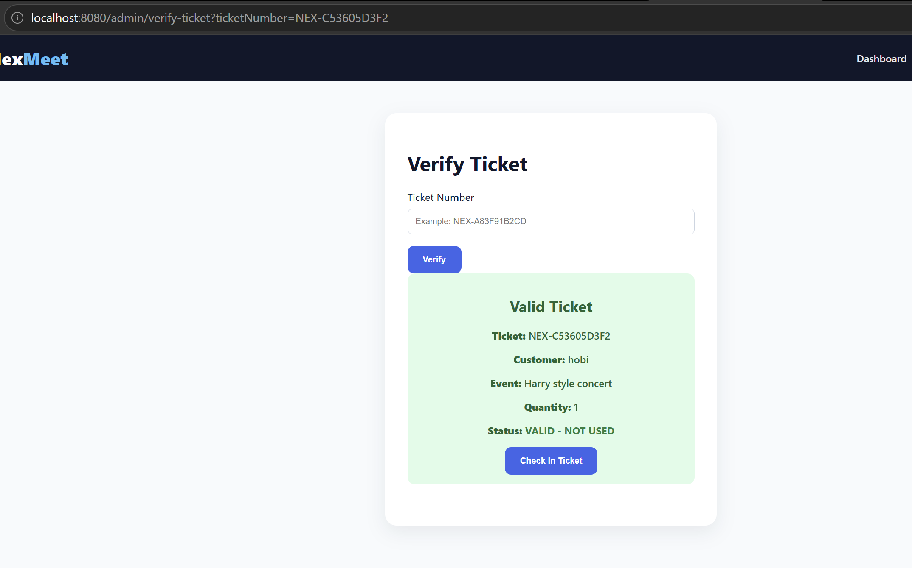

### Access Denied Page

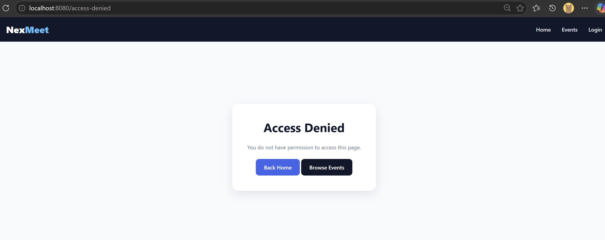

## Database Name

```sql
eventticketbooking
```

## Demo Admin Login

```text
Email: admin@nexmeet.com
Password: admin123
```

> These credentials are for local demo/testing only. Change them before using the system in a real deployment.

## How to Run Locally

### 1. Clone the Repository

```bash
git clone https://github.com/Tharindi-Weerasinghe/NexMeet-Event-Ticket-Booking.git
cd NexMeet-Event-Ticket-Booking
```

### 2. Create MySQL Database

Open MySQL and run:

```sql
CREATE DATABASE eventticketbooking;
```

### 3. Configure Database Connection

Create or update:

```text
src/main/resources/application.properties
```

Example:

```properties
spring.datasource.url=jdbc:mysql://localhost:3306/eventticketbooking
spring.datasource.username=root
spring.datasource.password=your_mysql_password

spring.jpa.hibernate.ddl-auto=update
spring.jpa.show-sql=true
spring.thymeleaf.cache=false
```

> The real `application.properties` file is ignored from Git to protect local database credentials.

### 4. Run the Application

For Windows PowerShell:

```bash
.\mvnw.cmd spring-boot:run
```

Then open:

```text
http://localhost:8080/
```

## Main Pages

| Page            | URL                    |
| --------------- | ---------------------- |
| Home            | `/`                    |
| Events          | `/events-page`         |
| Login           | `/login`               |
| Register        | `/register`            |
| Book Ticket     | `/book-ticket`         |
| My Tickets      | `/my-tickets`          |
| Admin Dashboard | `/admin`               |
| Manage Events   | `/admin/events`        |
| Add Event       | `/add-event`           |
| Bookings        | `/bookings-page`       |
| Verify Ticket   | `/admin/verify-ticket` |

## Project Structure

```text
src/main/java/com/tharindi/eventticketbooking
├── controller
├── model
├── repository
└── EventticketbookingApplication.java

src/main/resources
├── templates
├── static
└── application.properties.example
```

## Key Learning Outcomes

Through this project, I practiced:

* Building a full-stack Spring Boot application
* Connecting Spring Boot with MySQL
* Designing database entities and relationships
* Implementing CRUD operations
* Using Spring Data JPA repositories
* Building dynamic pages with Thymeleaf
* Implementing login and registration
* Hashing passwords with BCrypt
* Separating admin and customer access
* Handling booking logic and ticket availability
* Adding validation and custom error handling
* Creating a QR-based ticket system
* Improving frontend layout and user experience

## Future Improvements

* Full Spring Security integration
* Payment gateway integration
* Email ticket confirmation
* PDF ticket download
* Event categories and filters
* Pagination for events and bookings
* Unit and integration testing
* Docker support
* Cloud deployment
* REST API version with React frontend

## Author

**Tharindi Weerasinghe**
Cybersecurity Undergraduate

